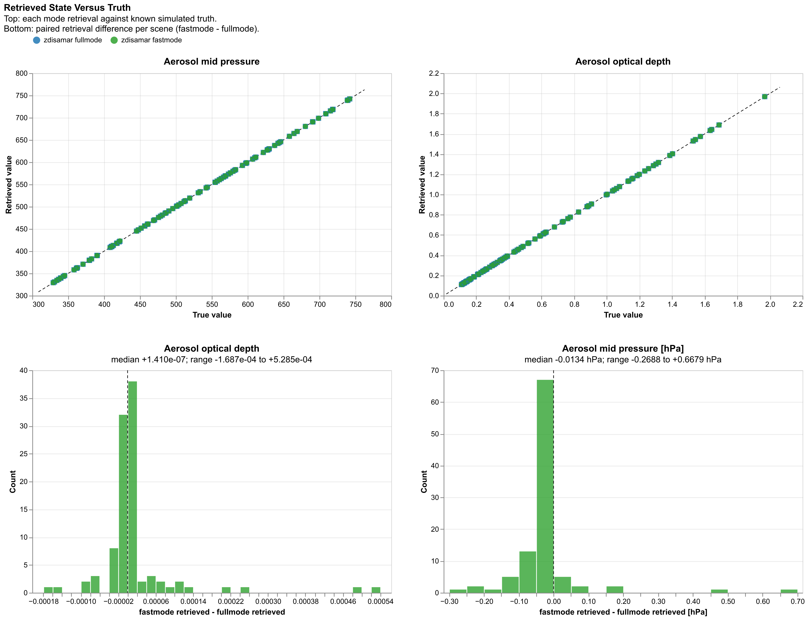

# zdisamar

`zdisamar` is a Zig implementation of the oxygen A-band radiative-transfer
model used in DISAMAR aerosol-layer-height retrieval studies. It calculates
top-of-atmosphere reflectance and reflectance derivatives for scenes in which
oxygen absorption, aerosol scattering, surface reflection, and instrument
spectral response all affect the measured spectrum.

The Fortran DISAMAR code family is the scientific reference for this work.
`zdisamar` keeps the same radiative-transfer problem and reorganizes the
repeated oxygen A-band calculations so validation cases can be run, timed, and
inspected through generated spectra and timing files.

The Python wrapper is demonstrated in executable notebooks under
[`scripts/demo/`](./scripts/demo/). Build the native library first:

```bash
zig build
```

Then open the notebooks:

```bash
uv run --with jupyterlab --with ipykernel python -m jupyter lab scripts/demo
```

The two demos are
[`o2a_plot_bundle.ipynb`](./scripts/demo/o2a_plot_bundle.ipynb), which shows the
Python-facing O2 A output and plotting accessors, and
[`optimal_estimation_demo.ipynb`](./scripts/demo/optimal_estimation_demo.ipynb),
which shows a two-state O2 A optimal-estimation flow.

The published Python package has no third-party runtime dependencies: the RTM,
optimal-estimation helpers, and notebook-facing SVG plots ship with the native
Zig library and standard-library Python wrapper code. Validation scripts that
regenerate tracked PNG comparison figures declare their own plotting
dependencies through `uv run --script` headers.

## Why The Oxygen A Band

The oxygen A band near 758-770 nm is a strong molecular oxygen absorption band
used by passive satellite retrievals to infer information about the vertical
placement of scattering layers. Oxygen is well mixed in the atmosphere, so the
absorption structure in a measured top-of-atmosphere spectrum carries
information about photon path length. Photons scattered by a lower aerosol or
cloud layer travel through more oxygen than photons scattered by a higher layer.

This makes the band useful for aerosol-layer-height and cloud-height retrievals.
The oxygen absorption signal is also sensitive to surface brightness, geometry,
aerosol optical thickness, and the balance between atmospheric and surface
contributions to the measured reflectance. Aerosols scatter less strongly than
clouds, so aerosol retrievals need a detailed RTM.


The figure links a visible aerosol scene to the O2 A reflectance spectrum seen
by the instrument: the aerosol contribution changes both the absolute
reflectance and the structure inside the absorption band. Aerosol optical
thickness, aerosol vertical distribution, and surface reflection all affect the
oxygen A-band retrieval.

That spectral change can be used to retrieve atmospheric properties. Light that
travels deeper into the atmosphere passes through more oxygen and therefore has
deeper absorption-band structure. If photons meet an aerosol or cloud layer
higher in the atmosphere, they scatter back toward the instrument earlier and
travel through less oxygen. The absorption profile then carries information
about where the scattering happened. An RTM makes this usable: for a
given atmosphere, surface, viewing geometry, and instrument response, it
calculates the reflectance spectrum and the derivatives needed by the retrieval
to update the atmospheric state.

## What Changed Relative To Fortran DISAMAR

The comparisons use the Fortran DISAMAR code family. Source links in the
performance notes point to the KNMI GitLab snapshot
[`d17c52884a875cb87b98e4c4ea7f722659e685ac`](https://gitlab.com/KNMI-OSS/disamar/disamar/-/tree/d17c52884a875cb87b98e4c4ea7f722659e685ac).

Fortran DISAMAR is the grandfather of this implementation. It is a mature
radiative-transfer and retrieval model for passive atmospheric remote sensing:
it reads a retrieval configuration, prepares atmospheric and surface inputs,
calculates spectra and Jacobians, and runs inverse methods such as optimal
estimation. Its strength is breadth. It supports many retrieval families,
spectral ranges, configuration options, and operational/research use cases. That
breadth also makes focused O2 A benchmarking difficult: a single aerosol-height
case still passes through general setup, broad configuration handling, and
general numerical routines built for a much wider set of retrieval problems.

Both implementations target the same O2 A retrieval RTM: line-by-line
oxygen absorption, multiple scattering, instrument-grid convolution, and
reflectance derivatives for optimal estimation. The performance improvements
come from reducing repeated setup around that calculation:

- scene, spectroscopy, geometry, and reference data are loaded once and reused
  across repeated RTM calls;
- optimal-estimation retrievals call the RTM several times while the
  scene, instrument grid, spectroscopy, and many optical inputs stay the same.
  Each iteration reuses that O2 A calculation state in memory;
- retrieval Jacobians are calculated for the active state-vector columns;
- common O2 A LABOS matrix shapes for the 20-stream case use specialized
  implementations in the repeated layer-doubling calculations;
- validation and benchmark evidence is stored under
  [`validation/outputs/`](./validation/outputs/).

The benchmark cases use `nstreamsSim = 20` and `nstreamsRetr = 20`. Streams are
the angular quadrature directions used by the multiple-scattering
radiative-transfer solver; more streams resolve the angular radiation field more
finely, but each RTM call costs more. The production DISAMAR O2 A
setup usually uses 16 streams, so these retained 20-stream timings are
deliberately slower than a production-tuned Fortran run.

The DISAMAR baseline configuration also keeps `aerosolLayerHeight = 0`. We do
not use the Fortran `aerosolLayerHeight = 1` flag to speed the comparison up,
because that flag activates an older shortcut path. The timings below therefore
compare `zdisamar` against the normal physical inverse problem, not against a
shortcut-accelerated DISAMAR run.

## Benchmarks

The benchmark evidence covers RTM timing and
optimal-estimation retrieval timing.

The timings in this section were recorded on the local benchmark machine: Mac
mini `Mac16,10`, Apple M4, 10 CPU cores (4 performance, 6 efficiency), 24 GB
RAM. Treat the absolute seconds as machine-specific wall-clock measurements; the
linked validation artifacts are the source for the reported case counts,
retrieved-state deltas, and timing summaries.

### RTM

The RTM benchmark calculates one O2 A spectrum over 755-776 nm. The
reported spectrum has 701 instrument-grid wavelengths, but each instrument
channel is an average over sharper oxygen absorption structure at higher
spectral resolution:

```text
low-overhead prepare_o2a       0.057692 s
low-overhead forward elapsed   1.328534 s
ztracy forward elapsed         2.443697 s
output wavelengths                  701
high-resolution radiance samples  3,874
LABOS Fourier terms             120,390
LABOS layer visits            5,417,550
doubling steps                8,389,666
```

The low-overhead evidence is
[`research/performance/tracing/output/lauka-forward/forward-run/summary.json`](./research/performance/tracing/output/lauka-forward/forward-run/summary.json).
The timeline trace summary is
[`research/performance/tracing/output/labos-bottleneck/summary.json`](./research/performance/tracing/output/labos-bottleneck/summary.json).
The detailed performance notes live in
[`research/performance/o2a-forward/`](./research/performance/o2a-forward/).

### Retrieval

The paired optimal-estimation sweep compares DISAMAR Fortran and `zdisamar`
using the same scene and a-priori sampling. Each system retrieves its own
simulated spectrum, which keeps the retrieval problem aligned while measuring
the two systems separately.

```text
DISAMAR Fortran: 100/100 converged, median 1228.826 s, mean 1189.862 s
zdisamar:        100/100 converged, median    3.624 s, mean    3.667 s
```


The lower row shows the paired retrieved-state difference for each scene,
computed as `zdisamar` retrieved value minus DISAMAR Fortran retrieved value:

```text
aerosol optical depth:       median +1.688e-08, mean -3.025e-07, range -3.703e-05 to +5.423e-06
aerosol mid pressure [hPa]:  median -0.0016,    mean -0.0020,    range -0.0522 to +0.0821
```

Fastmode retrieval is a zdisamar-only optimisation lane on the same O2 A case.
The normal case remains the full-physics reference. Enabling
`case.optimisation.fastmode.enabled` resolves inspectable RTM, adaptive-grid,
OE, sparse fast-stage wavelength sampling, and final-correction defaults before
execution. The shipped fastmode path solves the fast stage on the sparse
measurement grid, then uses that result as the starting state for one sparse
full-physics forward model plus Jacobian update.

```text
zdisamar fullmode: 100/100 converged, median 1.944 s, mean 1.899 s
zdisamar fastmode: 100/100 converged, median 0.538 s, mean 0.528 s
```



The retained fastmode sweep uses 38 fast-stage wavelengths and 12 full-physics
correction wavelengths on the validation measurement grid. Median speedup versus
fullmode is `+1.416 s`. The maximum fastmode-minus-fullmode deltas are
`5.285e-04` aerosol optical depth and `0.668 hPa` aerosol mid pressure.
These timings are wall-clock durations around the public retrieval call. They
include session/cache creation, native case load and preparation, native OE work,
and the sparse full-physics correction; they do not include scene construction,
simulated measurement construction, CSV writing, or plot rendering.
The technical note is
[`research/performance/o2a-retrieval/fastmode-final-correction.md`](./research/performance/o2a-retrieval/fastmode-final-correction.md).

The tracked paired DISAMAR/zdisamar summary is
[`validation/outputs/optimal_estimation/paired_oe_plot_manifest.json`](./validation/outputs/optimal_estimation/paired_oe_plot_manifest.json).
The tracked fastmode summary is
[`validation/outputs/optimal_estimation/zdisamar_o2a_fast_mode_sweep_comparison_summary.json`](./validation/outputs/optimal_estimation/zdisamar_o2a_fast_mode_sweep_comparison_summary.json).
The retrieval notes live in
[`research/performance/o2a-retrieval/`](./research/performance/o2a-retrieval/).

## Bottlenecks

The oxygen A band contains narrow absorption lines. To model an instrument
measurement, `zdisamar` calculates radiance at high-resolution wavelengths and
then applies the instrument spectral response to form the 701 reported
wavelengths.

The benchmark expands one spectrum as follows:

```text
701 output wavelengths
-> 3,874 high-resolution radiance samples
-> 120,390 LABOS Fourier terms
-> millions of layer, doubling, and scattering-order operations
```

The main remaining costs are the repeated LABOS radiative-transfer calculations:
Fourier transport, RT-layer construction, layer doubling, scattering-order
accumulation, and phase-matrix construction. The detailed timing and operation
counts are in
[`research/performance/o2a-forward/remaining-bottlenecks.md`](./research/performance/o2a-forward/remaining-bottlenecks.md).

## Python Package

Use `uv` to download the published Python package into an isolated environment.
The wheel includes the native RTM library and bundled O2 A reference data, and
the package has no third-party runtime dependencies:

```bash
uv run --with zdisamar python
```

The public API is intentionally small: build a simulated O2 A case, run the
native RTM, and pass the same case into optimal estimation when you want a
retrieval.

```python
from zdisamar import rtm
from zdisamar.inverse_method import optimal_estimation as oe
from zdisamar.rtm import SessionCache
from zdisamar.wavelength_bands import o2a
```

Build a complete simulated O2 A scene without preparing an external DISAMAR
input file. The wheel carries the native library and the reference assets.

```python
case = o2a.reference_case()
case.aerosol_optical_depth_550_nm = 0.32
case.aerosol_layer.mid_pressure_hpa = 760.0
```

Run the forward model and get normal Python arrays for the instrument wavelength
grid, radiance, irradiance, reflectance, and optional Jacobians.

```python
spectrum = rtm.spectrum(case)
jacobian_spectrum = rtm.spectrum(
    case,
    jacobian=True,
    jacobian_state_names=("aerosol_optical_depth",),
)
```

Aerosol profiles can be explicit vertical distributions for forward simulations,
not only one scalar aerosol layer.

```python
case.set_aerosol_profile(
    (
        o2a.AerosolProfileLayer(
            top_pressure_hpa=620.0,
            bottom_pressure_hpa=700.0,
            optical_depth=0.10,
            single_scatter_albedo=0.94,
            asymmetry_factor=0.66,
        ),
        o2a.AerosolProfileLayer(
            top_pressure_hpa=700.0,
            bottom_pressure_hpa=820.0,
            optical_depth=0.22,
            single_scatter_albedo=0.92,
            asymmetry_factor=0.63,
        ),
    )
)
```

Fastmode is a case-owned optimisation mode. Its RTM, adaptive-grid, OE, and
sparse wavelength choices are inspectable and tuneable.

```python
case = o2a.reference_case().with_fast_mode()
fastmode = case.optimisation.fastmode

fastmode.radiative_transfer.fourier_order_cap = 5
fastmode.radiative_transfer.threshold_doubl = 3.0e-5

fastmode.adaptive_reference_grid.points_per_fwhm = 28
fastmode.adaptive_reference_grid.strong_line_max_divisions = 22

fastmode.oe.controls.max_iterations = 10
fastmode.oe.fast_stage_sampling.windows = (
    o2a.FastModeWavelengthWindow((755.0, 758.5), 16),
    o2a.FastModeWavelengthWindow((765.2, 768.0), 25),
)
fastmode.oe.final_correction.wavelength_count = 12

resolved_fastmode = case.resolved_optimisation()["fastmode"]
```

The OE path uses the same case object. A `SessionCache` keeps prepared native RTM
state alive across the repeated forward-model and Jacobian evaluations.

```python
truth = o2a.reference_case()
measurement = oe.measurement_from_case(truth, reflectance_uncertainty=1.0e-4)

case = o2a.reference_case().with_fast_mode()
profile = oe.pressure_altitude_profile_from_case(case)
state_vector = oe.StateVector(
    (
        oe.AerosolOpticalDepth(
            initial=0.18,
            prior=0.18,
            uncertainty=0.5,
            lower=0.0,
        ),
        oe.AerosolLayerMidPressure(
            initial=820.0,
            prior=820.0,
            uncertainty=80.0,
            thickness_hpa=case.aerosol_layer.thickness_hpa,
            interval_index_1based=case.aerosol.placement.interval_index_1based,
            pressure_altitude_profile=profile,
        ),
    )
)

with SessionCache() as cache:
    result = oe.disamar_oe(
        case=case,
        measurement=measurement,
        state_vector=state_vector,
        cache=cache,
    )
```

Retrieval results stay in physical coordinates and include convergence history,
the averaging kernel, and lazy final-state diagnostics.

```python
retrieved_aod = result.value("aerosol_optical_depth")
retrieved_mid_pressure = result.value("aerosol_layer_mid_pressure_hpa")
iteration_history = result.history
```

The package also ships dependency-free SVG plotting accessors for common O2 A
diagnostics, so notebooks do not need Pandas or Matplotlib for the standard
views.

```python
reflectance_plot = spectrum.plot.reflectance()
jacobian_plot = jacobian_spectrum.plot.jacobian("aerosol_optical_depth")

convergence_plot = result.plot.convergence()
measurement_fit_plot = result.plot.measurement_fit()
retrieval_jacobian_plot = result.plot.jacobian()
```
