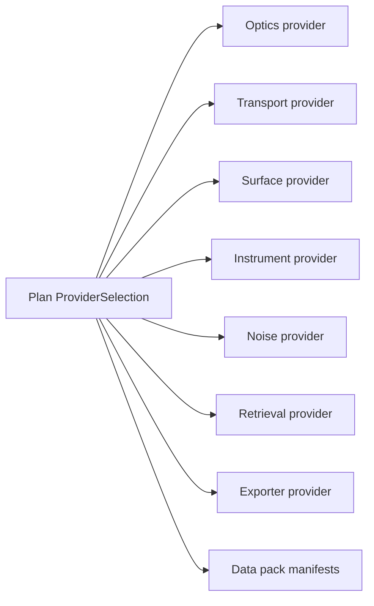
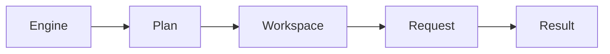
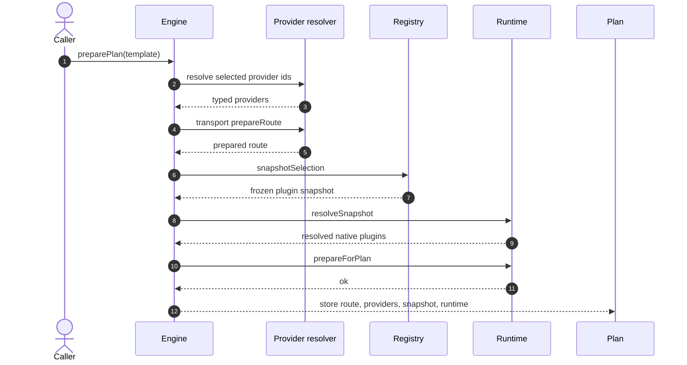
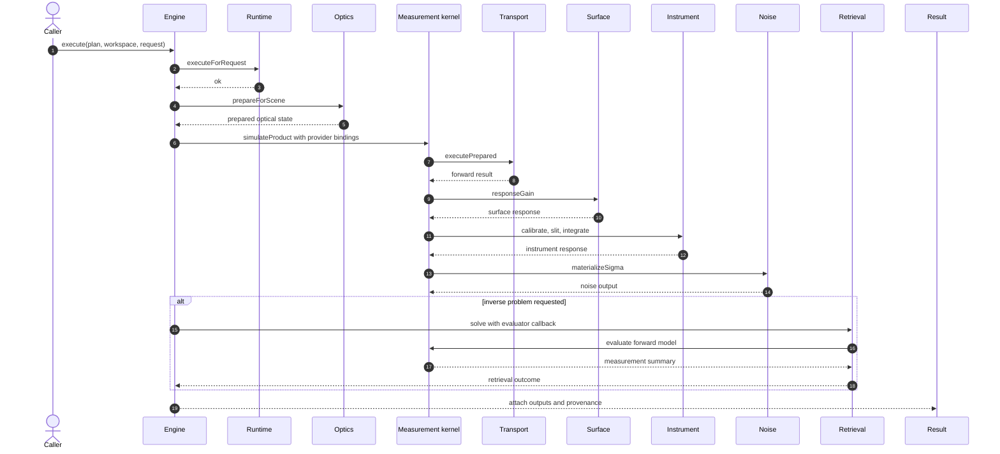

# Plugin System End-To-End Flow

The plugin system sits inside a stable execution contract:

`Engine -> Plan -> Workspace -> Request -> Result`

That outer shape does not change when a new transport solver, surface model, retrieval algorithm, or exporter is added. What changes is which provider the engine selects for each capability slot during plan preparation, and which frozen plugin inventory is carried into the run.

This document follows that path in the same order the code does:

1. the outer lifecycle,
2. the vocabulary used to describe plugins,
3. plan preparation,
4. request execution,
5. the native ABI layer,
6. provenance and exporters.

For the stricter architectural view of the extension boundary, see [Plugins and Extension Boundaries](./plugins-and-extension-boundaries.md).

## Why Plugin Systems Exist In Engines Like This

Plugin systems were not created just to make software extensible in the abstract. In scientific engines, they usually appear when one codebase needs to support multiple valid implementations of the same physical role without collapsing into a large set of hardcoded branches.

Radiative-transfer and retrieval systems are a good example because several parts of the stack evolve independently:

- optics data and optics preparation,
- transport solvers,
- geometry assumptions,
- surface and interface models,
- instrument response models,
- measurement products,
- inversion methods,
- exporters and benchmark data packs.

If all of those choices are hardwired directly into the engine, several problems appear quickly.

### Different scientific assumptions get entangled

A solver choice, a surface choice, and an instrument choice are different scientific decisions. If they are all represented as branches buried inside one kernel or one monolithic configuration loader, it becomes hard to change one assumption without accidentally coupling it to the others.

### New capabilities turn into branch accumulation

Without a plugin boundary, adding a new surface model or retrieval method often means adding another `if` chain in a hot path, another partially duplicated config path, and another ad hoc provenance rule. That scales poorly.

### Comparison becomes harder

Scientific work often needs to ask questions like:

- what changes if I keep the same scene and swap only the transport solver?
- what changes if I keep the same transport but swap the surface model?
- what changes if I run the same result through a different exporter?

Those comparisons are much cleaner when the engine can describe one stable experiment and swap only the provider chosen for a slot.

### Reproducibility suffers

If a run depends on hidden branching or mutable global configuration, it becomes harder to explain exactly which stack produced a result. A plugin system can force those choices to become named, versioned, and frozen into provenance.

### External extension becomes unsafe without a boundary

Sooner or later, a system like this wants to absorb new implementations from outside the current core tree. Without a clear boundary, extensions tend to reach directly into internal data structures and execution state. That makes the engine fragile. A plugin system creates an explicit contract instead.

That is the main reason the current design exists: it separates the stable execution lifecycle from the scientific implementations that need to evolve inside it.

## Current Capability Slots In The Tree

The current tree already exercises the main capability slots that participate in
plan preparation and request execution.

The current builtin selections are:

- `ProviderSelection.absorber_provider`
  - current builtin provider: `builtin.cross_sections`
  - resolved by `src/plugins/providers/optics.zig`
- `ProviderSelection.transport_solver`
  - current builtin provider: `builtin.dispatcher`
  - resolved by `src/plugins/providers/transport.zig`
- `ProviderSelection.surface_model`
  - current builtin provider: `builtin.lambertian_surface`
  - resolved by `src/plugins/providers/surface.zig`
- `ProviderSelection.instrument_response`
  - current builtin provider: `builtin.generic_response`
  - resolved by `src/plugins/providers/instrument.zig`
- `ProviderSelection.noise_model`
  - current builtin providers: `builtin.scene_noise`, `builtin.none_noise`, `builtin.shot_noise`, `builtin.s5p_operational_noise`
  - resolved by `src/plugins/providers/noise.zig`
- `ProviderSelection.retrieval_algorithm`
  - current builtin providers: `builtin.oe_solver`, `builtin.doas_solver`, `builtin.dismas_solver`
  - resolved by `src/plugins/providers/retrieval.zig`
- `ExportRequest.plugin_id`
  - current builtin providers: `builtin.netcdf_cf`, `builtin.zarr`
  - resolved by `src/plugins/providers/exporter.zig`
- data-pack manifests
  - current builtin provider: `builtin.cross_sections`
  - registered through the capability registry and carried into provenance

## 1. Start From The Outer Lifecycle

Before looking at plugins, it helps to look at the execution model that contains them.

- `Engine` owns long-lived host state such as catalogs, plugin registration, caches, and plan preparation.
- `Plan` freezes the decisions that should not drift during execution.
- `Workspace` owns per-run mutable scratch state.
- `Request` carries the scene and optional inverse problem.
- `Result` owns the scientific output and its provenance.

The plugin system fits inside that lifecycle. It does not replace it.

That is the first important constraint: plugins are allowed to provide implementations for parts of the run, but they do not get to redefine the run itself.

## 2. The Terms Used By The Plugin System

Three terms show up everywhere in the code: **slot**, **provider**, and **manifest**.

### Slot

A slot is a capability category. Examples in `src/plugins/slots.zig` include:

- `absorber.provider`
- `transport.solver`
- `surface.model`
- `instrument.response`
- `noise.model`
- `retrieval.algorithm`
- `diagnostics.metric`
- `data.pack`
- `exporter`

The slot tells the engine what kind of thing it is selecting.

### Provider

A provider is one concrete implementation for one slot.

Examples:

- `builtin.cross_sections`
- `builtin.dispatcher`
- `builtin.lambertian_surface`
- `builtin.generic_response`
- `builtin.oe_solver`
- `builtin.netcdf_cf`

The provider name is what the plan template uses for selection.

### Manifest

A manifest is the metadata record that describes a plugin package and the capabilities it publishes. The manifest stores things like:

- plugin id
- package
- version
- supported capabilities
- execution lane
- dataset hashes
- native entry metadata

One detail matters immediately:

- the **provider id** is the name used for selection and dispatch
- the **manifest id** is the identity of the plugin package record

Sometimes those are the same string. Sometimes they are not. The transport path is the clearest example: the selected provider is `builtin.dispatcher`, while the native manifest that advertises it is `builtin.transport_dispatcher`.

### Why These Names Were Chosen

The naming is trying to separate four different concerns that would otherwise blur together.

#### Why "slot"

The word **slot** was chosen because the engine is reserving a place for one capability, not naming a concrete implementation yet.

`surface.model` means:

- there is a place in the execution stack where a surface model must be supplied;
- the engine has not yet said which one.

That is why slot names read like categories rather than implementations.

The dotted form also has a purpose:

- the left side names the domain, such as `surface`, `transport`, or `instrument`;
- the right side names the role inside that domain, such as `model`, `solver`, or `response`.

So `transport.solver` is easier to read than a flatter name like `transport_solver_slot`, and `instrument.response` makes it clear that the slot is about the instrument's measurement response rather than the instrument as a whole.

#### Why "provider"

The word **provider** was chosen because the selected thing is expected to provide behavior to the engine.

That is more precise than words like "type" or "mode":

- a type sounds like static data shape;
- a mode sounds like a configuration flag;
- a provider suggests an implementation surface with functions behind it.

That matches the code in `src/plugins/providers/`, where a resolved provider becomes a typed struct with callable functions.

#### Why "manifest"

The word **manifest** was chosen because this object is a declaration of identity and contents. It says:

- who the plugin is,
- which capabilities it publishes,
- which version it is,
- whether it is declarative or native,
- which provenance metadata travels with it.

That is a different job from execution. The manifest describes the plugin package; it does not execute the plugin.

#### Why "ProviderSelection"

`ProviderSelection` is the name of the plan-time input because the object is doing exactly that job: selecting one provider per slot for the upcoming plan.

It is not called `PluginConfig` because that would sound broader and less precise. The important action at this stage is selection, not arbitrary configuration.

The field names in Zig use underscores, such as `transport_solver` and `surface_model`, because they are Zig identifiers. The slot strings stay dotted, such as `transport.solver` and `surface.model`, because those are capability names rather than Zig field names.

#### Why "PreparedProviders"

`PreparedProviders` means the provider ids have already been resolved into callable typed structs.

At that point the engine is no longer holding loose names. It is holding ready-to-use provider tables for optics, transport, surface, instrument, noise, diagnostics, and optional retrieval.

The name is meant to signal a transition:

- before resolution, the engine has names;
- after resolution, the engine has prepared dispatch surfaces.

#### Why "CapabilityRegistry"

The registry is named **CapabilityRegistry** rather than `PluginRegistry` because its main job is to index published capabilities, not merely to store plugin packages.

That distinction matters because one manifest can publish one or more capabilities, and plan preparation cares about the capabilities selected for slots, not just about package presence.

#### Why "PluginSnapshot"

The word **snapshot** was chosen to make the immutability claim explicit.

This object is not a live view into the registry. It is a frozen copy of the plugin inventory that mattered at plan-preparation time.

If it had been called something like `PluginView`, that would suggest a borrow into mutable global state, which is exactly what this design is avoiding.

#### Why "PreparedPluginRuntime"

This name is reserved for the ABI-facing runtime state that has already been resolved from the frozen snapshot and is ready to run native hooks.

The word **runtime** signals that this is no longer just metadata.
The word **prepared** signals that resolution has already happened.

#### Why "lane"

The word **lane** was chosen for `declarative` versus `native` because those are two parallel ways a plugin can participate in the system. They are not separate capability categories, and they are not separate model families. They are two execution-adjacent tracks through the same plugin architecture.

#### Why names like `builtin.*`

Provider and manifest ids use prefixes such as `builtin.` to make the source of the capability obvious.

That helps distinguish:

- capabilities shipped with the engine,
- capabilities that may come from an external package later.

It also keeps ids readable in provenance records, where origin matters.

## 3. What A Plan Really Freezes

The plugin system is plan-centric.

When a plan is prepared, the engine decides which providers will be active for that plan and captures the plugin inventory needed to explain and reproduce that decision later.

By the time a request is executed, the plan already owns:

- the chosen provider selection,
- the prepared transport route,
- the typed provider tables used by the hot path,
- the frozen plugin snapshot,
- the resolved native plugin runtime.

That is the purpose of `src/core/Plan.zig`: it is the place where plugin choice becomes fixed execution state.

## 4. How Plan Preparation Works

The next step is to see what actually happens inside `Engine.preparePlan(...)`.

Read that sequence in six steps:

1. The plan template carries a `ProviderSelection`.
2. The engine resolves those selected provider ids into typed provider structs.
3. The selected transport provider prepares the route for the requested regime and solver mode.
4. The registry freezes the selected plugin inventory into a `PluginSnapshot`.
5. Any manifests marked as `native` are resolved through the ABI runtime from that frozen snapshot.
6. The finished `Plan` stores everything required to execute later without re-running selection logic.

Two things are happening at once here:

- the engine is deciding **which implementations** will be used;
- the engine is recording **which plugin inventory** justifies those implementations.

That distinction becomes important later, because the execution path uses typed provider structs, while provenance is built from the frozen snapshot.

## 5. The Registry's Job

The registry is not the execution engine. Its job is to maintain the inventory of known capabilities and to materialize a frozen view of the subset that matters for a plan.

That frozen view is the `PluginSnapshot` built in `src/plugins/registry/CapabilityRegistry.zig`.

The snapshot contains:

- the selected capabilities for the plan,
- the manifests that back those capabilities,
- dataset-hash metadata for declared data packs,
- native entry metadata for native manifests.

The important design choice is that the snapshot is **owned** data. It is cloned into the plan, not borrowed from mutable registry state. That makes provenance and reproducibility explicit.

## 6. What Execution Looks Like After The Plan Exists

Once the plan exists, plugin selection is over. `Engine.execute(...)` is now working with a frozen set of provider bindings and a resolved native runtime.

That diagram answers the most practical question about the plugin cutover:

the forward model is not supposed to inspect scene strings or hardcoded `kind` branches to decide what surface or instrument behavior to use. It receives a typed `ProviderBindings` bundle and calls the selected providers directly.

In other words, selection happens once during plan preparation. Execution then uses the result of that selection.

## 7. Typed Provider Dispatch And Native Plugins Are Not The Same Thing

This is the part that is easiest to blur together if the explanation jumps too quickly.

### Typed provider dispatch

This is the mechanism used by the main execution path.

The provider resolver in `src/plugins/providers/` turns selected provider ids into typed Zig structs such as:

- optics provider
- transport provider
- surface provider
- instrument provider
- noise provider
- diagnostics provider
- retrieval provider

Those structs contain typed function pointers such as:

- `prepareForScene`
- `prepareRoute`
- `executePrepared`
- `responseGain`
- `materializeSigma`
- `solve`

The hot path uses those typed provider calls. That is why the kernels can stay free of string lookup logic.

### Native plugin runtime

The native runtime is the ABI-facing layer in `src/plugins/loader/runtime.zig`.

It does something different:

- inspect the frozen snapshot,
- find manifests whose lane is `native`,
- resolve their entry points,
- call `prepare` at plan time,
- call `execute` at request time.

So the system has two cooperating layers:

- typed provider dispatch for the main execution path,
- native ABI resolution for plugin lifecycle hooks and external extension boundaries.

That is why a provider can be part of the selected execution stack while a manifest can also carry native runtime metadata about the same capability.

## 8. Declarative And Native Lanes

The manifest layer distinguishes between `declarative` and `native`.

### Declarative

A declarative manifest contributes capability metadata without requiring native ABI loading. This is the right shape for:

- data packs,
- exporter registrations,
- builtin registrations that do not need ABI hooks,
- provenance-bearing capability declarations.

### Native

A native manifest contributes capability metadata and also resolves through the plugin ABI. This is the right shape for:

- external shared-library plugins,
- builtin plugins that expose static symbols through the ABI,
- providers that need native `prepare` and `execute` hooks.

The engine does not treat that distinction as cosmetic. It determines whether the runtime loader needs to resolve native entry points from the frozen snapshot.

## 9. Why Plan-Time Freezing Matters

The plugin system is designed around a strong rule:

**the identity of the execution stack must not drift during a run.**

That gives the engine three properties it would not otherwise have.

### Reproducibility

You can say which provider stack produced a result.

### Stability

The kernel is not repeatedly asking the registry what to do.

### Hot swapping with boundaries

You can change the plugin inventory or choose different providers by preparing a new plan, while older plans keep their original frozen state.

That last point is the practical meaning of "hot-swappable" in this architecture. It does not mean mutating an already-running plan in place. It means the next prepared plan can select a different capability stack without rewriting the engine lifecycle.

## 10. Where Provenance Comes From

The result provenance in `src/core/provenance.zig` is built from the plan's frozen plugin snapshot.

That provenance records:

- selected plugin versions,
- dataset hashes,
- native capability slots,
- native entry symbols,
- native library paths.

So a result can answer both of these questions:

- which provider stack was selected for this run?
- which concrete plugin inventory backed that selection?

## 11. Why Exporters Sit Slightly Outside The Main Run

Exporters are also selected by plugin id, but they run after the scientific result has already been produced.

The flow is:

1. prepare a plan,
2. execute the request,
3. obtain a `Result`,
4. hand that result to an exporter provider.

So exporters participate in the plugin system, but not in the transport and retrieval call chain itself.

## 12. Reading The Code In The Same Order

If you want to trace the implementation after reading this document, the cleanest order is:

1. `src/plugins/slots.zig`
2. `src/plugins/selection.zig`
3. `src/plugins/providers/root.zig`
4. `src/plugins/registry/CapabilityRegistry.zig`
5. `src/plugins/loader/runtime.zig`
6. `src/core/Plan.zig`
7. `src/core/Engine.zig`
8. `src/kernels/transport/measurement_space.zig`
9. `src/core/provenance.zig`
10. `src/adapters/exporters/writer.zig`

By that point the full picture should read as one continuous chain:

- the engine accepts a provider selection,
- the plan freezes that selection into executable state and provenance state,
- execution uses typed provider calls,
- native hooks are resolved from the frozen snapshot,
- the result records the plugin inventory that made the run possible.
